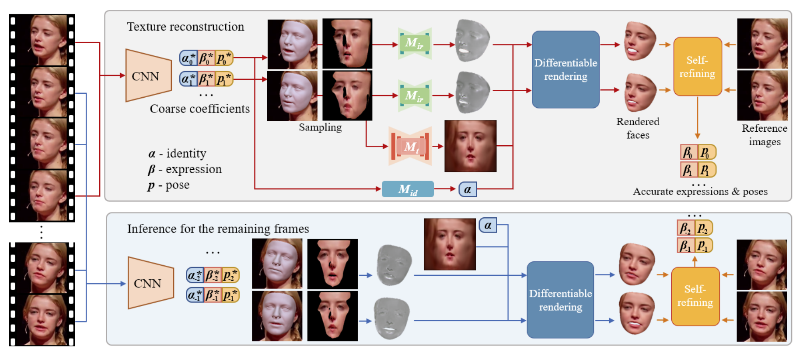

## ABSTRACT
Face alignment is a fundamental yet challenging task for various facial analysis applications. Existing video-based face
alignment (VFA) methods often neglect the consistency of facial geometries and textures across video sequences, thereby
limiting their ability to handle accurate and stable face alignment. This paper presents a robust and highly accurate 3D
Morphable Model (3DMM)-based VFA approach that leverages a novel texture generation method and a self-refined procedure for face alignment. By employing a differentiable
rendering technique and a self-refined optimization method,
we iteratively fine-tune facial geometries, textures, and poses.
Experimental results demonstrate that our approach outperforms existing state-of-the-art methods in both accuracy and
temporal stability.
## Pipeline

